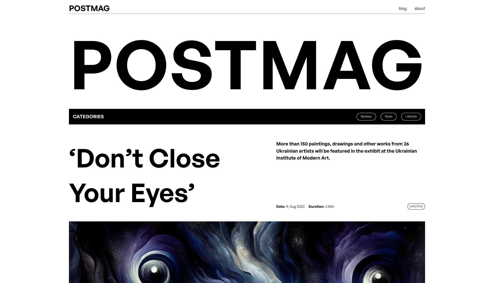

# Project Name

See the live version of [Project Name](https://devmentor.pl).

1-3 sentences about the project...

**Main features**:

-   **Scalable Architecture**: Designed to handle growing content and user base efficiently.
-   **Prismic as Headless CMS**: Utilizes Prismic for flexible and powerful content management.
-   **Minimalistic Layout**: Focuses on content, providing a clean and distraction-free reading environment.
-   **Header Article Feature**: Offers the option to highlight a header article on the landing page, enhancing content visibility.

&nbsp;

## 💡 Technologies


&nbsp;

## 💿 Installation

The project uses [node](https://nodejs.org/en/) and [npm](https://www.npmjs.com/). Having them installed, type into the terminal: `npm i`.

&nbsp;

## 🤔 Solutions provided in the project

**Custom Hook for Top Scrolling**: A custom hook enables automatic scrolling to the top of the page when navigating via links, improving user experience.

&nbsp;

-   **ArticleLead Component**: This component is not only scalable but also offers two layout variants based on props, providing flexibility in presentation.

&nbsp;

-   **Responsive Font Scaling**: Page header fonts are designed to scale with page size, ensuring readability and aesthetic appeal across devices.

&nbsp;

-   **Custom Pagination**: Built from scratch, the pagination feature includes two layout variants (prevButton/nextButton & numbers) for enhanced navigation.

```
some example code

more code :)
```

&nbsp;

-   three

| Issue | Solution             |     |
| ----- | -------------------- | --- |
| one   | `short code example` |     |
| two   | `short code example` |     |
| thre  | `short code example` |     |

&nbsp;

-   four - some shortcut <kbd>Ctrl</kbd> + <kbd>C</kbd>

&nbsp;

-   five - example with a screenshot
    

&nbsp;

## 💭 Possible future features

-   **Long Reads Section**: Implementing a selection for in-depth, long-form articles.
-   **Bookmarking Feature**: Allowing users to bookmark and revisit their favorite articles.

&nbsp;

## 🙋‍♂️ Feel free to contact me

Write sth nice ;) Find me on...

&nbsp;

## 👏 Thanks / Special thanks / Credits

Thanks to my [Mentor - devmentor.pl](https://devmentor.pl/) – for providing me with this task and for code review.
