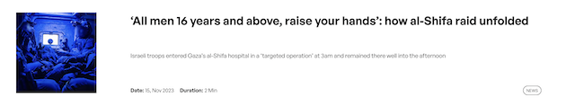
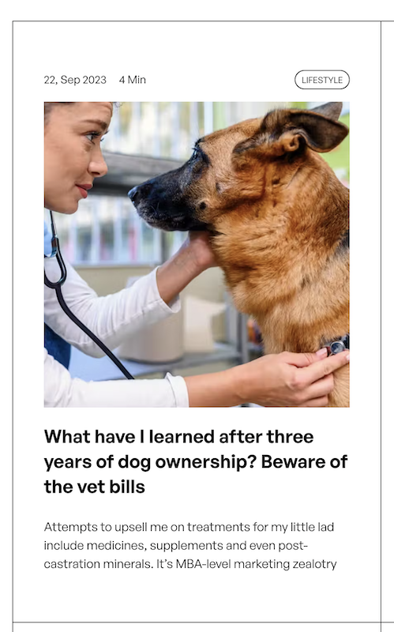

# POSTMAG - blog website with Prismic CMS

See the live version of [POSTMAG](https://yakksiek.github.io/blog-prismic-cms/#/).

This project is a scalable, minimalistic blog platform built using modern web development technologies. It leverages Prismic as a headless CMS, allowing for easy content management and integration. React Router v5 and StyledComponents are used to create a seamless and responsive user experience. The layout is intentionally minimalistic, focusing on content readability and user engagement.

**Main features**:

-   **Scalable Architecture**: Designed to handle growing content and user base efficiently.
-   **Prismic as Headless CMS**: Utilizes Prismic for flexible and powerful content management.
-   **Minimalistic Layout**: Focuses on content, providing a clean and distraction-free reading environment.
-   **Header Article Feature**: Offers the option to highlight a header article on the landing page, enhancing content visibility.

 

## 💡 Technologies


 

## 💿 Installation

The project uses [node](https://nodejs.org/en/) and [npm](https://www.npmjs.com/). Having them installed, type into the terminal: `npm i`.

 

## 🤔 Solutions provided in the project

**Custom Hook for Top Scrolling**: A custom hook enables automatic scrolling to the top of the page when navigating via links, improving user experience.

 

-   **ArticleLead Component**: This component is not only scalable but also offers two layout variants based on props, providing flexibility in presentation.




 

-   **Responsive Font Scaling**: Page header fonts are designed to scale with page size, ensuring readability and aesthetic appeal across devices.

```javascript
const StyledH1 = styled.h1`
    font-family: var(--font-extra-bold);
    letter-spacing: 5px;
    font-size: 11rem;
    font-size: clamp(5.5rem, 17.5vw, 17rem);
    text-align: center;
    margin-bottom: 0;

    @media ${({ theme }) => theme.media.tablet} {
        font-size: 5.5rem;
        font-size: clamp(3rem, 16vw, 12rem);
    }

    @media ${({ theme }) => theme.media.mobile} {
        padding: 1rem 0;
        font-size: 3.5rem;
        font-size: 15.2vw;
    }
`;
```

 

-   **Custom Pagination**: Built from scratch, the pagination feature includes two layout variants (prevButton/nextButton, numbers or both) for enhanced navigation.

```javascript
export function generatePaginationData(currentPage, limit, length) {
    const pages = Math.ceil(length / limit);

    const begin = limit * (currentPage - 1);
    const end = currentPage * limit;

    const prevPage = currentPage > 1 ? currentPage - 1 : 1;
    const nextPage = currentPage < pages ? currentPage + 1 : pages;

    const generatePageNumbers = () => {
        const range = [];
        const rangeWithDots = [];

        for (let i = 1; i <= pages; i++) {
            if (i === 1 || i === pages || i === currentPage || (i >= currentPage - 1 && i <= currentPage + 1)) {
                range.push(i);
            }
        }

        let l = null;
        for (let i of range) {
            if (l) {
                if (i - l === 2) {
                    rangeWithDots.push(l + 1);
                } else if (i - l !== 1) {
                    rangeWithDots.push('...'); //
                }
            }
            rangeWithDots.push(i);
            l = i;
        }

        return rangeWithDots;
    };

    const isPrevDisabled = currentPage <= 1;
    const isNextDisabled = currentPage >= pages;

    return {
        prevPage,
        nextPage,
        pageNumbers: generatePageNumbers(),
        isPrevDisabled,
        isNextDisabled,
        pages,
        begin,
        end,
    };
}
```

&nbsp;

## 💭 Possible future features

-   **Long Reads Section**: Implementing a selection for in-depth, long-form articles.
-   **Bookmarking Feature**: Allowing users to bookmark and revisit their favorite articles.

&nbsp;

## 🙋‍♂️ Feel free to contact me

Write sth nice ;) Find me on [LinkedIn ](https://www.linkedin.com/in/marcin-kulbicki-426817a4/) or [Instagram](https://www.instagram.com/yakksiek/)

&nbsp;

## 👏 Credits

Thanks to my [Mentor - devmentor.pl](https://devmentor.pl/) – for providing me with this task and for code review.
